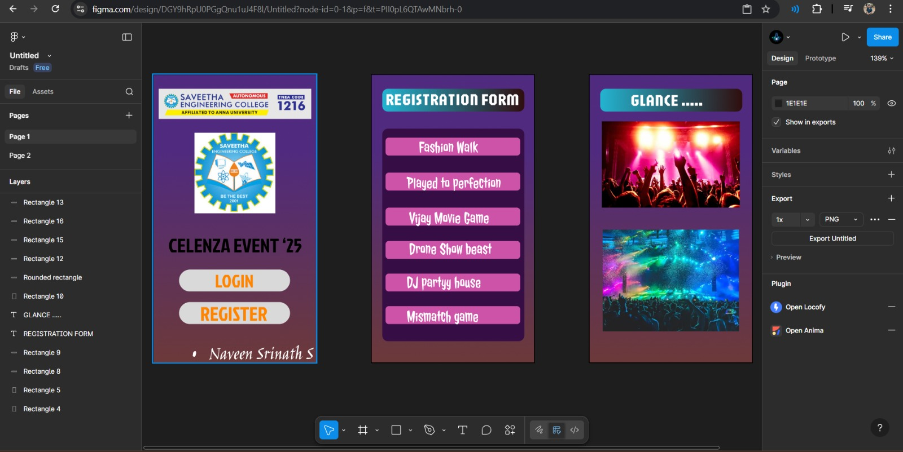

# Ex09 Event Registration Web Application
## Date: 25.12.2025

## AIM:
To design, develop and deploy a web application for event registration.

## DESIGN STEPS:

### Step 1:
Create a new frame.

### Step 2:
Select any one preset size of your choice.

### Step 3:
Select the shapes you need.

### Step 4:
Import images as needed.

### Step 5:
Create pages based on your need and link them.

### Step 6:

Validate the HTML and CSS code.

### Step 6:

Publish the website in the given URL.

## DESIGN TOOL:
Figma

## CODE:
```
HOME PAGE

<!DOCTYPE html>
<html lang="en">
<head>
  <meta charset="UTF-8">
  <meta name="viewport" content="width=device-width, initial-scale=1.0">
  <title>Celenza Event 25</title>
  <link rel="stylesheet" href="style.css">
</head>
<body>

  <div class="container">

    <!-- College Header -->
    

    <!-- College Logo -->
    

    <!-- Event Title -->
    <h1 class="event-title">CELENZA EVENT ’25</h1>

    <!-- Buttons -->
    <button class="btn login-btn">LOGIN</button>
    <button class="btn register-btn">REGISTER</button>

    <!-- Footer Name -->
    <p class="footer-text">• Naveen Srinath S</p>

  </div>

</body>
</html>
* {
  margin: 0;
  padding: 0;
  box-sizing: border-box;
}

body {
  font-family: 'Arial', sans-serif;
  height: 100vh;
  background: linear-gradient(180deg, #4b1c6b, #7a2b5a);
  display: flex;
  justify-content: center;
  align-items: center;
}

.container {
  width: 360px;
  height: 740px;
  background: transparent;
  text-align: center;
  padding: 20px;
  position: relative;
}

/* Header */
.header-img {
  width: 100%;
  border-radius: 4px;
  margin-bottom: 30px;
}

/* Logo */
.college-logo {
  width: 180px;
  margin: 20px auto;
}

/* Event Title */
.event-title {
  font-size: 26px;
  font-weight: 900;
  color: #000;
  margin: 30px 0;
  letter-spacing: 1px;
}

/* Buttons */
.btn {
  width: 240px;
  padding: 14px;
  margin: 12px auto;
  font-size: 20px;
  font-weight: bold;
  border: none;
  border-radius: 30px;
  cursor: pointer;
  display: block;
}

.login-btn {
  background: #e5e5e5;
  color: #ff7a00;
}

.register-btn {
  background: #e5e5e5;
  color: #ff7a00;
}

/* Footer */
.footer-text {
  position: absolute;
  bottom: 20px;
  width: 100%;
  color: white;
  font-size: 18px;
  font-family: cursive;
}

2nd PAGE

<!DOCTYPE html>
<html lang="en">
<head>
  <meta charset="UTF-8">
  <meta name="viewport" content="width=device-width, initial-scale=1.0">
  <title>Registration Form</title>
  <link rel="stylesheet" href="style.css">
</head>
<body>

  <div class="screen">

    <!-- Header -->
    <div class="title-box">
      <span class="title-blue">REGISTRATION</span>
      <span class="title-dark">FORM</span>
    </div>

    <!-- Events Card -->
    <div class="card">

      <button class="event-btn">Fashion Walk</button>
      <button class="event-btn">Played to perfection</button>
      <button class="event-btn">Vijay Movie Game</button>
      <button class="event-btn">Drone Show beast</button>
      <button class="event-btn">DJ partyy house</button>
      <button class="event-btn">Mismatch game</button>

    </div>

  </div>* {
  margin: 0;
  padding: 0;
  box-sizing: border-box;
}

body {
  height: 100vh;
  font-family: 'Arial', sans-serif;
  background: linear-gradient(180deg, #3b145f, #6b2b5a);
  display: flex;
  justify-content: center;
  align-items: center;
}

/* Mobile screen */
.screen {
  width: 360px;
  height: 740px;
  padding: 20px;
  border: 2px solid #00b3ff;
  background: transparent;
}

/* Header */
.title-box {
  display: inline-flex;
  border-radius: 8px;
  overflow: hidden;
  margin-bottom: 30px;
}

.title-blue {
  background: #2ec4d6;
  color: white;
  padding: 8px 14px;
  font-weight: 900;
  letter-spacing: 1px;
}

.title-dark {
  background: #2b0d2b;
  color: white;
  padding: 8px 14px;
  font-weight: 900;
  letter-spacing: 1px;
}

/* Card */
.card {
  background: #3a0a4a;
  border-radius: 20px;
  padding: 25px 15px;
}

/* Event buttons */
.event-btn {
  width: 100%;
  background: #d65db1;
  border: none;
  border-radius: 10px;
  padding: 14px;
  margin: 12px 0;
  font-size: 18px;
  font-weight: bold;
  color: white;
  cursor: pointer;
  transition: transform 0.2s, box-shadow 0.2s;
}

.event-btn:hover {
  transform: scale(1.03);
  box-shadow: 0 4px 10px rgba(0,0,0,0.3);
}


3rd PAGE
<!DOCTYPE html>
<html lang="en">
<head>
  <meta charset="UTF-8">
  <meta name="viewport" content="width=device-width, initial-scale=1.0">
  <title>Glance</title>
  <link rel="stylesheet" href="style.css">
</head>
<body>

  <div class="screen">

    <!-- Header -->
    <div class="glance-title">
      GLANCE .....
    </div>

    <!-- Image Section -->
    <div class="image-box">
      
    </div>

    <div class="image-box">
      
    </div>

  </div>

</body>
</html>

* {
  margin: 0;
  padding: 0;
  box-sizing: border-box;
}

body {
  height: 100vh;
  font-family: Arial, sans-serif;
  background: linear-gradient(180deg, #3b145f, #6b2b5a);
  display: flex;
  justify-content: center;
  align-items: center;
}

/* Mobile screen */
.screen {
  width: 360px;
  height: 740px;
  padding: 20px;
  border: 2px solid #00b3ff;
}

/* Header pill */
.glance-title {
  background: linear-gradient(90deg, #2ec4d6, #2b0d2b);
  color: white;
  text-align: center;
  font-size: 22px;
  font-weight: 900;
  padding: 12px;
  border-radius: 10px;
  margin-bottom: 30px;
  letter-spacing: 1px;
}

/* Image containers */
.image-box {
  margin-bottom: 30px;
  border-radius: 12px;
  overflow: hidden;
}

.image-box img {
  width: 100%;
  height: auto;
  display: block;
  border-radius: 12px;
}


</body>
</html>


```

## OUTPUT:


## RESULT:
The program to design, develop and deploy a web application for event registration is completed successfully.
